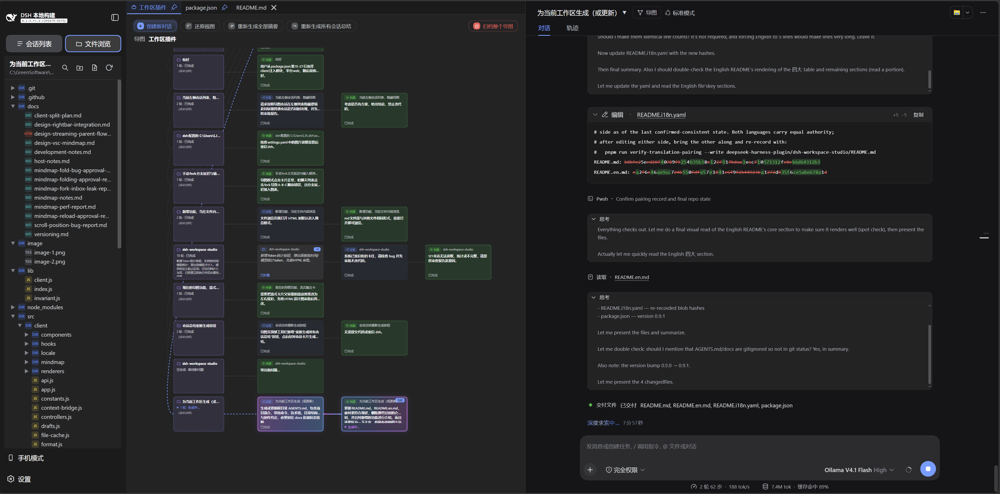

# 🗂️ DeepSeek Harness Workspace Studio Plugin (Four-Pane Layout)

English | [中文](README.md)

This bundle replaces the DeepSeek Harness Web root layout with four panes: **session/workspace selector · current workspace file tree · highlighted file view and guarded editor · chat**. It preserves the existing sidebar, conversation, details, and global-overlay Slot contracts, so the built-in plugins keep owning new-session creation, workspace session lists, settings, chat, tool details, and approvals. Tool details open as a right-side drawer over the four-pane layout instead of consuming a permanent pane.

## 📸 Screenshots

|  |  |
|---|---|

## ✨ Key Highlights

| Capability | Description |
|---|---|
| 📁 **Workspace file tree** | Appears automatically when the session belongs to a Workspace; directories first, incremental expansion, and **expanded state and scroll position restore per session** after a reload |
| ⌨️ **CodeMirror 6 editor** | 20+ language syntax highlighting, line numbers, code folding, in-editor search, word wrap, and 14 text encodings |
| 🗂️ **Preview tabs** | Persisted per session, survive reloads, drag reorder, pinned tabs, drafts never lost, conflict protection |
| 🎯 **Editor context** | Open files / selections inject as `<opened_file>` / `<selection>` prefixes; history keeps a one-line summary |
| 🧹 **File operations** | Right-click create / rename / copy / cut / paste / delete / copy path, with shortcuts |
| 📱 **Mobile mode** | One-click switch to a centered phone column; file browsing can fill the phone column |
| 🧭 **Mind map** | Conversation branch tree: reverse-parses the full session log into turn cards and persists them, forks a new branch at any card, rename / delete cards, archive the whole map |
| 🔒 **Security boundary** | Workspace-confined read/write, path containment, revision conflict protection, symlink rejection |

## 🧩 Features

### File Tree

- Automatically shows the Workspace file tree when the current Session belongs to a Workspace (also recognized when the Session `cwd` equals its path); directories sort before files, with incremental expansion, collapse, and manual refresh.
- Expanded folders persist per current session and re-expand after a reload; selecting a tab reveals it in the tree and restores the vertical scroll position.
- The sidebar top row switches between **Sessions / File Explorer** views; right-clicking the session title renames the current session.
- Drag-resize the session, tree, and editor panes (up to 80% of the layout while open); layout parameters persist globally in `localStorage`.

### Editor

- CodeMirror 6 shows line numbers and syntax highlighting based on filenames or extensions; unknown types use plain text. A fold gutter and in-editor search (`Ctrl/Cmd+F`, `F3`) are built in.
- `Ctrl+K+J` unfolds every collapsed fold region; `Ctrl+K+1..9` folds code by nesting level (e.g. `Ctrl+K+2` folds every second-level fold region).
- Editable files **open directly in edit mode** (no **Edit** button); the panel header offers **Cancel**, **Save**, **Word wrap**, and **Reload from disk** (refresh). Read-only files (dropped external files, oversized, truncated, mixed line endings, symlink paths, or editing disabled) show a read-only reason banner.
- Each file-type group can pick an editor highlight preset (Default, Classic, Warm, Cool, Monochrome, XML (VS Code)) from the Explorer settings page, remembered per type in `localStorage`.

### Encodings

- File preview auto-detects the encoding (UTF-8 / UTF-8 BOM / UTF-16 LE / BE / GBK / GB18030 / Big5 / Shift_JIS / EUC-JP / EUC-KR / ISO-8859-1 / Windows-1252 / Windows-1251 / ASCII).
- Right-click the preview header to **Open With Encoding…** (re-decode) or **Save As Encoding…** (write back); the panel header shows the current encoding badge.
- The encoding list is authoritative from the server `/api/encodings`; a failed request falls back to the built-in list, so the actions never dead-end.

### Preview Tabs

- Opened files enter per-Session preview tabs: `X` to close, drag to reorder, and tabs survive reloads.
- **Pinned tabs**: right-click a tab to **Pin / Unpin**; pinned tabs show a pin icon and sort first, and **Close Other Tabs** only closes unpinned tabs.
- Unsaved edits show a `·` after the tab label and after the filename in the preview panel title; it disappears once saved.
- Unsaved drafts are kept in staging files (see Editing & Saving); localStorage only holds the dirty marker, never content; switching files never silently discards unsaved content.
- The tab bar scrolls horizontally with the wheel, and newly activated tabs auto-scroll into view.

### Editing & Saving

- Editable files **open directly in edit mode** with **Save**, **Cancel**, and `Ctrl/Cmd+S`.
- **Staging draft file**: editing takes one **snapshot** (the source content); all temporary edits are debounce-written to a **draft file** (`~/.dsh-plugin/dsh-workspace-studio/drafts/<workspaceId>/`, long-lived), and the **source file is never touched**; a page refresh restores from the draft file (draft + snapshot + encoding). Auto-save is not a "save", so the `·` stays until an explicit save. localStorage only keeps the dirty marker, not the edit content or snapshot.
- **Save (merge back to source)**: saving re-reads the source and compares it with the snapshot —
  - Source unchanged by other tools (= snapshot): silently write the staged content back to the source, then delete the draft file.
  - Source changed in different places than your edits: automatic three-way merge keeps both sides and writes back.
  - Source changed in the same place as your edits: the dialog walks each conflicting region — the top two columns show an inline add/delete diff (My changes / Disk version), the bottom two columns show the resulting code without markers, letting you pick **Keep my version / Keep disk version** per region, or **Cancel** to abort the save.
- **Cancel**: discards the temporary edits, deletes the draft file, and restores the editor to the source content (the source file itself is not changed).
- Rejects binary, non-UTF-8, and out-of-Workspace symlink files; truncated large files, mixed-line-ending files, and symlink-traversing paths are read-only.

### File Operations

- Creates files and folders at the selected level and renames with `F2`.
- Context menu: Copy Name, Copy Path, Copy Relative Path, and **Reveal in Explorer** (opens the OS file manager).
- Right-click Copy / Cut / Paste / Delete, with shortcuts `Ctrl/Cmd+C`, `Ctrl/Cmd+X`, `Ctrl/Cmd+V`, `Del`.
- Cut + Paste = move; colliding targets auto-rename (`a.txt → a-1.txt`); delete asks for confirmation and adds a warning when unsaved tabs are affected.
- The clipboard is in-memory and workspace-isolated (paste from another Workspace is disabled) and resets on reload; external files (dropped-in read-only previews) cannot be renamed or deleted.

### Search

- Search results group by file: clicking a file header collapses / expands that file's matches, and clicking a match opens the file and jumps to the line.
- Case-sensitive toggling is supported; files too large to be fully searched are marked **Partial**.
- The Explorer settings page chooses whether search results default to expanded or collapsed.

### Editor Context

- The editor context appears as a non-editable prefix outside the textarea through the existing input dock: active sends freeze the context and render `<opened_file>...</opened_file>` or, for selected text, `<selection>...</selection>` (no file bytes without a selection); gray sends attach nothing.
- The Host validates it, prepends it to the direct user prompt, and the conversation view folds it into a one-line summary above the bubble showing the file name and range; history renders the logged user message only.

### Chat Experience

- The UI language follows the Harness setting (Settings → General → Language; Chinese / English) and switches live, with no restart or reload.
- The assistant's Think disclosure opens automatically while its reasoning streams and collapses after a configurable delay (0–10 s in 0.1 s steps, default 3 s; manual interaction during the window cancels the collapse), deferring to manual user interaction; the Explorer settings page can disable this and adjust the delay.
- The `/init` command (Claude Code style) generates or updates `AGENTS.md` at the current session's workspace root; when the file already exists a dialog offers **Update** or **Cancel**, and the current agent analyzes the workspace and generates it.
- Drop external files into the preview pane to preview them as read-only tabs (session-only; nothing is written to the workspace). Only text files are accepted: images, folders, and other non-text content show a “cannot preview as text” notice (images belong to the chat composer — intentional).

### Mind Map (Conversation Branching)

- The **Mind Map** button in the session header opens a **floating window on the left side of the page** (width = 100% − the chat column's current width, reflowing live as the splitter drags), while the **chat stays visible and usable on the right**; click the button again, the × in the corner, or press Esc to close. On first open, the plugin reverse-parses the session's **full event log into all its turns**, renders them as cards (trunk 1 → 2 → 3 → 4 → 5), and persists them to `~/.dsh-plugin/dsh-workspace-studio/mindmap/` — that persisted document is the mind map's **single source of truth**.
- After conversion the ordinary session is hidden from the sidebar session list and replaced by a self-drawn entry at the **end of the session list under its workspace group**; clicking it opens the session and pops the mind-map window. Every fork session derived from the map is hidden from the list too and managed from the map only.
- Clicking a card is **switch-first, fork-as-fallback**: a card where a branch is parked (a chain-tail card) **switches to that branch** (the right-side chat follows, the highlight moves — free branch switching); a middle card with no parked branch (e.g. card 6 inside branch 6-7) **forks a new branch there** and enters chat, its new turns sitting beside its sibling (6 → 8, 9 beside 7). Every fork belongs to the **same main mind map** — a fork never creates a new map — and the new branch session stays hidden from the sidebar session list. The branch's new turns are folded back into the document by the Host sync from the branch session's full log.
- Right-click a branch to **rename** it; the toolbar can **archive the entire mind map** (with all its branch sessions; the window closes after archiving the whole map). Right-click any card (trunk cards included) to **delete the card** (a true truncation): a new session is forked from the previous card and replaces the original — this card, the turns after it, and every branch derived from them are removed, and the original session is archived (currently no restore path), so the chat and the map both continue from the truncation point with matching numbering. The map supports **grab-pan, wheel zoom**, and **Restore view**.
- While a branch is **generating** (a question was submitted and the agent is streaming), the map shows a live "**Generating…**" card (pulsing border, carrying the in-flight question) framed together with its **parent card** inside one dashed **frame** as a unit; when the turn completes the card converts into a normal card and the frame disappears. The streaming card is not clickable (an unfinished turn cannot be a fork point).

### Appearance & Settings

- Uses Harness semantic theme variables and supports light, dark, and system themes.
- Explorer settings page: tree row height, search result display, file icon badge colors, per-type highlight presets, save-conflict dialog font size, chat font size, and Think auto-expand / collapse delay.
- A **Mobile mode** toggle in the sidebar footer (same approach as dsh-mobile-preview) collapses the layout into a centered phone column; the sidebar becomes a floating drawer opened by the whale at the top-left (session list and file tree stay inside it), and a **Browse files** button appears right of the whale in the conversation header to fill the phone column with file browsing while the header stays reachable. Mobile mode is transient, so a reload returns to the desktop layout.

## 🎨 Syntax Highlighting

Built in for **20+ languages**: JavaScript/JSX, TypeScript/TSX, JSON, HTML, CSS/SCSS/Less, Markdown/MDX, Python, SQL, XML/SVG, YAML, C/C++, Java, Rust, PHP, Go, Shell, PowerShell, Ruby, TOML, and Dockerfile.

`Makefile`, `.gitignore`, `.env`, `LICENSE`, and unknown extensions stay browsable and editable in plain text.

## 🧩 Dual-Face Implementation

One package ships three faces:

- **Host entry** (`lib/index.js`) registers `/workspace-studio/api`: it lists directories by Workspace ID, reads bounded UTF-8 files, authorizes the current Session by membership or canonical cwd, and, when editing is explicitly enabled, saves existing regular files, creates files and folders, and renames entries through revision validation, single-segment name checks, and atomic replacement — refusing stale revisions instead of overwriting them. It also serves `/mindmap-doc` (read / write / delete) plus `/mindmap-doc/sync`, `/mindmap-doc/index`, and `/mindmap-doc/rename`, persisting per-session mind-map documents built by reverse-parsing full event logs, with renames updating only the map title instead of round-tripping the whole document.
- **Browser entry** (`lib/client.js`) provides the compatible `ctx.layout` service, occupies the root Slot, keeps declaring `sidebar`, `conversation`, `details`, and `shell.overlay`, and adds the file tree, the CodeMirror 6 browser/editor, the editor-context row, the Explorer settings tab, the `/init` command, and the conversation mind-map view.
- **Shared invariants** (`lib/invariant.js`) back every Host request with path-containment and write-eligibility checks.

### Activation Model

The layout provider intentionally does not hard-inject `conversation`: the conversation plugin itself consumes `layout`. The bundle therefore uses a child injection after activation to patch the existing `sendSession` seam and to register the editor row in `conversation.input.dock`, avoiding an activation cycle.

### Known Limitations and Deferred Work

The editor-context bridge adapts the concrete Harness 0.1.x `sendSession`, input-submit, and queue-steer implementations because the public cross-package faces do not carry arbitrary Composer context. These seams stay behind this package and are restored on unload, so a future Harness release may require updating only this bundle.

Layout state, expanded directories, editor selection, and the workspace draft cache remain page-memory state; preview tabs and their per-tab vertical scroll positions persist and are restored across reloads and when returning to the previous Session or Workspace.

### Model Experience

When the prefix is active and the primary CodeMirror selection is non-empty, each send captures that exact selected text, its normalized workspace path, and its range, then renders it as a `<selection>...</selection>` envelope. When the selection is empty, each send captures only the open file path and renders the fixed `<opened_file>...</opened_file>` envelope; it never submits the full file.

The Browser bridge prepends the rendered text to the direct user prompt, so the ordinary `user/message` record contains the exact model-visible context. The conversation view folds that same envelope into a compact row above the bubble, showing the file name and the line/column range; hovering that row reveals the full injected XML. Gray prefixes contribute no context, and the same context is intentionally recorded again on each later active turn.

#### Token and KV Cache Effect

Selection contexts add the selected text plus the `<selection>...</selection>` envelope to input tokens. The Explorer preflights selected text against its default 65,536-byte UTF-8 limit; the Host independently bounds the complete rendering at 69,632 bytes by default and reads at most 10 MiB for clean revision verification. Truncated previews use browser-authoritative selection text. Path-only contexts add only the `<opened_file>...</opened_file>` envelope and no file bytes. Every active turn has its own logged prompt text, so repeated selections may increase prompt tokens until compaction.

## 📦 Installation

Run from Git Bash, Linux, or WSL. First `cd` into the directory that holds this bundle (use your own path):

```sh
cd <bundle-dir>
bash ./install.sh          # default target is the web profile
bash ./install.sh web      # a profile can be supplied explicitly
```

> In the sample path `C:/GreenSoftware/deepseek-harness/deepseek-harness-plugin/dsh-workspace-studio`
> the `deepseek-harness-plugin` segment is the author's custom plugin folder name, not a requirement.
> `install.sh` resolves the Harness root as two levels above the bundle directory (for the
> `pnpm --dir` fallback when `dsh` is not on PATH), so **the recommended layout is a plugin folder
> two levels under the Harness root** (as in the example); with `dsh` on PATH the bundle can live
> anywhere.

The script first uses `dsh` from PATH; when the current directory belongs to a Harness checkout and PATH has no `dsh`, it uses `pnpm --dir <harness-root> dsh`, and `DSH_BIN` may name an executable. After installation, **stop and restart the existing Web process** (stop it first, then start it again so the bundle reloads into the Web process), then refresh `http://127.0.0.1:3080`; the script does not start a second server.

## 🗑️ Uninstallation

```sh
bash ./uninstall.sh
```

Restart the existing Web process after removal; the built-in `ui-layout` returns when the bundle layer is removed.

## ⚙️ Configuration

The plugin row in `cordis.patch.yml` accepts:

| Field | Default | Description |
|---|---:|---|
| `enableEditing` | `false` | Enables the Host write endpoint; this bundle patch sets it to `true`. |
| `maxContextBytes` | `65536` | Explorer preflight maximum for selected-text UTF-8 bytes (1024–1048576); path-only contexts submit no file bytes. |
| `maxPromptContextBytes` | `69632` | Host maximum for the complete rendered context, including the envelope and selected text (4096–2097152). |
| `maxContextSourceBytes` | `10485760` | Maximum raw source bytes read for clean revision verification (1024–104857600). |
| `maxEditableBytes` | `1048576` | Maximum UTF-8 bytes saved for one file (1024–10485760). |
| `maxEntryNameBytes` | `255` | Maximum UTF-8 bytes allowed for one entry name (1–1024). |
| `maxEntriesPerDirectory` | `1000` | Maximum entries returned for one directory (1–10000). |
| `maxMutationBodyBytes` | `4096` | Maximum JSON bytes accepted by create and rename requests (128–65536). |
| `maxPreviewBytes` | `1048576` | Maximum bytes read and returned for one file (1024–10485760). |

> 💡 Edit the bundle's `cordis.patch.yml` to change these values. To prevent pnpm from reusing an installed local `file:` copy, run `uninstall.sh`, then `install.sh`, and finally restart the Web process.

## 🔒 Security Boundary

**Path containment**: Host endpoints accept only registered Workspace IDs and relative paths; every read or write resolves the real path and confirms the target stays under the canonical Workspace root, so `..`, absolute paths, and out-of-Workspace symlinks are inaccessible. The endpoints also enforce Host, Origin, and Fetch-Metadata source checks equivalent to the built-in `/api` routes.

**Write protection**: The write endpoint accepts `PUT` only when `enableEditing` is enabled; the body must be bounded UTF-8 text carrying the read-time `If-Match` revision, and a mismatch returns a conflict without overwriting. The target must be an existing regular file reached without any symbolic link. Create and rename reuse the same containment checks, require single-segment names, and refuse existing targets. The Host commits through a same-directory temporary file, file synchronization, and atomic rename, preserving the original permission mode when possible.

**Context safety**: Editor context accepts only a relative path in a Workspace that owns the current Session (through its membership projection or the Session's canonical cwd); a path-only context carries no file bytes. The Host rejects symbolic links, validates clean selections against their disk revision, treats previews truncated by `maxPreviewBytes` as browser-authoritative, and prepends the rendered text to the direct prompt, so the ordinary Session log records the exact model-visible context. The conversation view folds that envelope into a one-line summary above the bubble showing the file name and range, and history renders the logged user message without rereading the current editor or disk.

> ⚠️ These constraints govern only the explorer's file endpoints and Composer context; they do not change Agent permission policy, sandboxing, or tool capability. The endpoints provide application-level path-containment checks for trusted local UI use and do not replace Harness kernel-level isolation.

## 📁 Project Structure

```text
.
├── package.json                         # Single-package manifest: bundle patch + client inject + exports
├── cordis.patch.yml                     # Disables the built-in root layout and mounts this plugin (self-referencing)
├── install.sh / uninstall.sh
├── src/client/index.js                  # Browser source
├── lib/index.js                         # Host: bounded Workspace read, save, create, and rename API
├── lib/invariant.js                     # Shared Host invariants
└── lib/client.js                        # Prebuilt four-pane layout, file tree, and editor
```

CodeMirror and its language modules are bundled into the prebuilt plain-JavaScript Client artifact, so installation runs no builds or tests. To maintain the source, run `pnpm install --config.auto-install-peers=false` in the repo root and then `npm run bundle` to regenerate `lib/client.js`.

## 🔄 Compatibility

This version targets a Harness `0.1.x` checkout that provides the `conversation.input.dock` Slot, the session input resolver, and the conversation send service. The editor-context behavior is implemented entirely by this bundle and does not require modified Harness source; the send bridge adapts the concrete 0.1.x send, input-submit, and queue-steer seams, so a future release may need only a bundle-internal bridge update. A higher-priority patch that re-enables `ui-layout` competes for the root Slot; retain this bundle's `ui-layout` disable entry.
