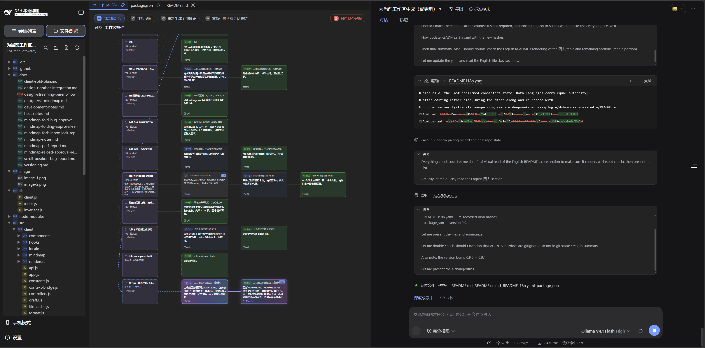

# 🗂️ DeepSeek Harness 工作区 Studio 插件（左中右三栏布局）

[English](README.en.md) | 中文

此 bundle 将 DeepSeek Harness Web 的根布局替换为**左中右三栏**：**左侧栏（Session / 工作区选择器 + 文件树视图切换）· 中部高亮文件预览与受控编辑器 · 右侧聊天**。文件预览栏默认在对话左侧，可在「工作区设置 → 浏览与预览」中切到右侧；文件树不再独占一栏，而是融合进左侧栏，与「会话列表」通过顶部按钮互切。会话头部提供「导图」按钮，可随时进入**导图模式**：会话分支树在预览区作为标签页打开，右侧聊天保持可见、可继续对话。

插件保留现有侧栏、会话、详情与全局浮层的 Slot 合约，内置的新建会话、会话列表、设置、聊天、工具详情、审批等仍由原插件提供；工具详情以右侧抽屉覆盖在三栏布局上，不额外占用常驻栏位。

## 📸 界面预览

|  |  |
|---|---|

## ⭐ 四大核心能力

| # | 能力 | 一句话价值 |
|---|---|---|
| 1 | 🗂️ **工作区文件浏览与预览标签页** | 在对话旁边像 IDE 一样浏览工作区：文件树、按会话恢复的预览标签、14 种编码与 Markdown / HTML / 图片 / PDF / Office 文档渲染视图 |
| 2 | ✏️ **打开即改的内置编辑器** | CodeMirror 6 打开即可编辑，改动全程落在暂存盘草稿，保存时与磁盘三方合并，**永不静默覆盖** |
| 3 | 🧭 **会话分支导图** | 把一条对话线变成可自由分叉的导图：任意轮次 fork 新分支、分支会话集中管理、流式输出可视化 |
| 4 | 🎯 **编辑器上下文注入** | 打开的文件或选中的代码以 `<opened_file>` / `<selection>` 注入对话，模型看到的就是你选的那一段 |

### 1️⃣ 工作区文件浏览与预览标签页

- 文件树融合在**左侧栏**：顶部按钮在「会话列表 / 文件浏览」间互切；当前会话属于某 Workspace 时自动显示其文件树（会话 `cwd` 与 Workspace 路径一致时同样识别），目录优先、逐级展开、可手动刷新。展开状态**按会话持久化**，刷新后自动恢复；点击「刷新」重新列目录后树的滚动位置也会还原（预览标签的垂直滚动位置同样随会话恢复）。
- **预览标签页按 Session 保存**：可关闭、拖拽重排、滚轮横向滚动、跨重载恢复；右键可**固定**（图钉图标、自动排前，「关闭其他标签页」只关未固定）或**在新窗口内打开**。存在未保存修改时，标签名与面板标题的文件名末尾显示 `·`。
- **文件树单击 = 临时标签（斜体），双击 = 正式标签**：单击文件只是**临时预览**——再单击其它文件时**不新增标签**，而是在原位置把斜体标签换成为新文件；**双击**（或双击标签栏里的斜体标签、右键固定、在该标签里开始编辑）才转成正式标签。任何时点最多一个临时标签；替换永不吞掉未保存内容（有编辑就先转正式），刷新后恢复出来的标签一律为正式标签。搜索结果与聊天里的文件直达仍按原语义打开正式标签。
- **查看方式菜单**（渲染器注册表驱动，与 Harness 右侧栏文档预览同源）：Markdown 在「源码编辑 / 渲染预览」间切换并**默认渲染预览**（GFM：表格、任务列表、删除线）；HTML 在「源码编辑 / 页面预览」间切换并**默认页面预览**，相对脚本与样式表经标准工作区文件接口打包进沙箱 iframe（编辑内容实时生效，打包防抖 400 ms）；图片（png / jpg / jpeg / gif / webp / bmp / ico / svg）直接预览；只读文本可分页浏览完整文件。查看方式按文件切换时重置为该文件的默认视图、不持久化。
- **PDF 与 Office 文档预览**（渲染器注册表新增 `pdf` / `office` 两类）：`.pdf` 经标准工作区文件接口取原始字节直接预览；`.doc / .docx / .ppt / .pptx / .xls / .xlsx` 交给 Harness Host 的 `officeToPdf` 服务在**本机用 LibreOffice 转成 PDF** 后预览（有界队列 + 按内容摘要缓存，重复打开不再重转）。两者都以 blob URL 交给**浏览器自带 PDF 阅读器**渲染，因此缩放、翻页、文字选择与打印都可用，且不向产物里塞 PDF 引擎；转换缺字体时在顶部横幅列出字体名。这类标签与图片一样**只读、无草稿、不进编辑器上下文**，磁盘变更时自动重新转换。Host 未挂载转换服务时给出「当前 dsh 未提供文档转换服务」提示而不是空白。
- **编码**：自动检测 14 种编码（UTF-8 / UTF-8 BOM / UTF-16 LE / BE / GBK / GB18030 / Big5 / Shift_JIS / EUC-JP / EUC-KR / ISO-8859-1 / Windows-1252 / Windows-1251 / ASCII）；右键预览头可「以编码打开…」重新解码或「另存为编码…」写回磁盘，面板头显示编码徽标；编码清单以 Host `/workspace-studio/api/encodings` 为准，请求失败回退内置清单，操作不会中断。
- **聊天里的文件直达预览**：聊天中打开工作区文件（`dsh-resource://file/...` 地址）不再落到 Harness 右侧栏，而是解析为当前会话工作区内的路径，直接在本插件的预览标签页中打开；**工作区外的文件**转为会话内的只读外部预览标签（标签名标注「工作区外文件」，不写工作区、不落盘），只有「会话没有关联的工作区」才给出明确提示。
- **计划直达预览**：计划审批条带的「查看全文」与回合末尾「计划」卡片的「打开」（`dsh-resource://plan/...` 与 `dsh-resource://plan-review/...` 地址）同样落在本插件的预览标签页里，以渲染后的 Markdown 显示完整计划；已记录的计划经 Harness 的 plan 资源读取会话历史，临时审阅文本只存在于本次页面（刷新后标签不再恢复）。计划标签是会话内的临时标签，不写入预览持久化。
- **变更审查直达预览**：回合末尾「变更文件」卡片（头部或任一文件行，`dsh-resource://changes-review/session/...` 地址）在本插件的预览标签页里打开该轮的**变更审查**：左侧列出该轮所有变更文件（含 +/− 行数，二进制与超大文件以标签标注），右侧按 Harness 的 `api/changes.summary` / `api/changes.diff` 路由渲染逐文件统一 diff（行号、`@@` 段头、新增 / 删除着色，超过 5000 行截断提示），头部可「在编辑器中打开」当前文件（工作区外走只读预览）。标签按索引定位到点击的那一行，同一轮重复点击只会跳转而不新开标签；审查标签是会话内的临时标签，不写入预览持久化。标签内左右两栏（文件列表 / 内容对比）之间可**拖拽调宽**（也支持键盘 ←/→ 步进），宽度是**页面内的临时状态**：切换预览标签、切换会话或工作区再切回都不变，刷新后回到默认（与审查标签本身一样不落盘）。
- 可将外部文件拖入预览面板以只读标签查看（会话内有效，不写入工作区）；仅文本类文件可预览，图片属聊天输入区，此为有意行为。
- **可执行文件「代码预览 + 运行控制台」**：打开 `py / pyw / sh / bash / zsh / ps1 / psm1 / bat / cmd / exe / com` 时（POSIX 上带可执行位的无扩展名文件同样算），预览列变成**上下两段**——上方仍是原来的代码预览（编辑、保存、搜索、差异色标与滚动条刻度全部不变），下方新增**运行控制台**。控制条一行给出状态胶囊（未运行 / 运行中计时 / 退出码与用时 / 已中止 / 无法运行）、**Host 解析好的命令**（解释器与文件是固定的只读前缀，尾部参数可直接编辑、回车即运行）以及运行 / 停止 / 重跑 / 清空 / 复制 / 跟随（自动滚到底部）六个按钮；预览列较窄时按钮组自动换行，绝不裁掉按钮。中间的分隔条可**拖动调高**（也支持键盘 ↑/↓ 步进、回车或双击复位为 62/38），高度与折叠状态按标签记在页面内存里；文件头新增的「控制台」按钮折叠 / 展开下半段，正在运行的文件**无论切到哪个标签**，标签栏上都有蓝色脉冲点。输出按行实时显示（stdout 默认色、stderr 红字、运行中末尾闪烁光标），结束时补一行退出摘要（如「· 进程已退出，代码 1 · 用时 1.24 s」）；**刷新页面不会中断进程**，重新打开该文件即可接着看（Host 侧保留 256 KB 环形缓冲与运行记录）；同一文件同时只允许一个进程，不同文件可并行（上限 8 个）。
- **解释器可自定义（文件级 + 全局按后缀）**：运行控制台元信息条末项的「解释器 py -3」不只是一段文字，而是**按钮**——上面标出**当前生效的解释器与它的来源**（自动检测 / 此文件指定 / 全局 `.py` 指定 / 直接执行），点开即为**这一个文件**指定解释器的绝对路径（可「测试」取版本号、可清除回到自动检测，还能顺手勾「同时设为 `.py` 的全局解释器」）。设置 → **工作区设置 → 解释器** 里新增「**全局自定义解释器**」：11 个可运行后缀逐行列出**当前生效值**（自动检测到的也显示，`.zsh` 一类找不到的直接标「未找到」），可为每个后缀指定所有工作区共用的解释器，并列出所有**文件级覆盖**（可逐个或全部清除）。解析优先级固定为 **文件 > 全局后缀 > 自动检测**；保存时校验「绝对路径 + 文件存在 + 可执行」，不通过就地报错、**不写入**；事后解释器被卸载 / 移动时，控制台用琥珀条写明「哪一层失效了、失败路径是什么、现在回退到哪一层」，**绝不静默回退**。自定义解释器的参数按**被指定的那个程序**判定（`-3` 只给 `py` 启动器，指向 `python.exe` 时不再误拼 `python.exe -3`）。
- **运行的安全边界**：命令以 **argv 数组**交给 `spawn`，**从不经过 shell**（参数文本没有转义面）；解释器只在白名单里按 PATH 解析（Windows 的 `py -3` → `python`、`.bat` 走 `cmd /c`、`.ps1` 走 `powershell -NoProfile -NonInteractive -ExecutionPolicy Bypass -File`、`.exe` 直接执行），**首次运行会弹确认框**列出实际命令、工作目录、解释器（含来源）与风险说明，可勾选「本工作区不再询问」（该信任标记落在 Host 侧，两端共享）；工作目录固定为文件所在目录，路径走与其他接口相同的工作区围栏校验；`stdin` 关闭（脚本读到 EOF 而不是把面板挂住），子进程环境剥离 `DSH_*` 变量；「停止」先 `SIGTERM`（Windows 用 `taskkill /T /F`）并在 1.5 秒后强杀**整个进程树**，dsh 退出时也会终止所有由它启动的进程。找不到解释器时给琥珀提示卡（列出已尝试的名字），可就地**重新检测**或**指定解释器绝对路径**（同样存在 Host 侧）。
- **Windows 上跑 `.sh`**：解释器只认 **Git for Windows 的 bash**（先探 `%ProgramFiles%\Git\bin\bash.exe` 等三处标准安装位置，再退回 PATH），**不使用 Windows 自带的 `bash.exe`**——那是 WSL 启动器，没装分发版时只会打印「安装分发版」的说明，而装了分发版也不能接收本插件传的参数（文件与工作目录都是 Windows 路径）。两者都没有时，控制台给的是「装 Git for Windows 或指定 bash 路径」的提示，而不是一段看不懂的报错。同理，Microsoft Store 那种 **0 字节的 `python.exe` 占位符**不会被当成解释器。
- **输出编码自动识别**：子进程的字节没有声明编码，Windows 上尤其不是 UTF-8（WSL 与 PowerShell 5.1 往管道写 **UTF-16LE**、`cmd` 里的工具按系统代码页写 **GBK** 等）。控制台按 BOM → NUL 特征 → 严格 UTF-8 → 系统区域代码页的顺序自动识别（逐流、跨块保持状态），所以中文脚本的中文输出不会变成乱码。

### 2️⃣ 打开即改的内置编辑器

- **打开即编辑**：可编辑文件无需「编辑」按钮，打开即进入编辑状态；面板头提供「取消」「保存」「自动换行」与「从磁盘重新读取」（刷新）。只读文件（外部拖入、超大、截断、混合换行、符号链接或未启用编辑）显示只读原因横幅。
- **预览文字大小（每个标签各自记，只在源码编辑视图出现）**：文件头右侧**第一枚**控件（在「控制台」左侧）是 `A− 100% A+` 步进器，用来调整该标签**源码编辑器正文**的文字大小：点 `A−` / `A+` 按 10% 一档增减（60%–200%，到边界按钮置灰），**点中间的数字可直接输入百分比**（只收数字、最多 3 位），回车确认后立刻生效（`Esc` 取消、点别处＝确认）；输入超范围会夹到边界并在底部状态栏说明，**清空（或输入 0）回车＝清除本标签的设置、回到基础字号**（输入框里灰字提示的就是基础字号）。生效时底部状态栏回一句「文字大小：150%」。
  - **预览状态下隐藏**：这枚控件只作用于**编辑状态的文件内容**，所以切到渲染视图（Markdown / HTML 预览、只读文件的分页浏览）时整个控件不显示，那些视图的文字大小由 harness 自己的字号决定（Markdown / HTML 标签打开时默认就落在渲染视图，点「编辑」才会看到这枚控件）。
  - **跟随标签走**：大小属于**标签自己**（不是全局开关），切到别的标签再切回来保持不变；刷新页面、重启 dsh 后随之恢复（和标签列表同一份存储、同一寿命，不会出现「标签回来了、字号没回来」）。关闭标签后重新打开同一文件会回到基础字号（不记忆单文件历史字号）。
  - **基础字号**在「工作区设置 → 浏览与预览」里（见下文）；没有单独调过字号的标签一直跟随它，调过的标签不受影响。标签行、文件头、底部状态栏等周边界面保持原样（行号槽、折叠箭头、差异竖条宽度也不变）。图片 / PDF / Office 转换预览没有这枚按钮。
- **暂存盘（草稿文件）**：进入编辑时提取一次**快照**（源文件内容），之后所有临时修改防抖写入位于**工作区之外**的暂存盘文件（`~/.dsh-plugin/dsh-workspace-studio/drafts/<workspaceId>/`，长期留档），**源文件全程不被触碰**；刷新页面后草稿、快照与编码一并恢复。自动写盘不视为「保存」，`·` 保留到显式保存；localStorage 只记脏标记，不存内容。
- **保存即三方合并**：保存时重新读取源文件并与快照比较——源文件未被改动则**静默写回**并删除暂存盘文件；双方改动不在同一位置则**自动三方合并**、双方修改都保留；同一位置冲突则弹窗逐处展示（上方两栏为行内增删对比「我的修改 / 磁盘版本」，下方两栏为修改后的实际代码），可分别选择「保留我的版本 / 保留磁盘版本」，取消则放弃保存。**取消**会删除暂存盘并让编辑器回到源文件内容，源文件本身不改动。
- **外部变更自动同步**：默认开启，对每个打开的标签约每 2 秒检查一次磁盘变更。干净且激活的标签被其他工具改动时自动重载（标签闪一下表示内容已换）并保留滚动位置（可改为「仅提示，不自动刷新」）；**每个标签自带磁盘状态标记**——蓝环 = 磁盘已变更（悬浮变 ↻，点击就地重载，后台标签同样标记）、琥珀点 = 有未保存改动、琥珀芯 + 蓝环 = 磁盘已变更且你有未保存改动、红环斜杠 + 删除线 = 文件已被删除，右键标签还有「重新加载」；**未保存的脏标签绝不覆盖**，只提示由你决定（保存时三方合并或逐处选择）；后台标签只标记、绝不自动重载。
- **语法高亮与编辑体验**：20+ 语言高亮、行号、**差异色标**与**折叠箭头**、编辑器内搜索（`Ctrl/Cmd+F`、`F3`）；`Ctrl+K+J` 展开所有已折叠区域，`Ctrl+K+1..9` 按层级折叠（如 `Ctrl+K+2` 折叠所有第二层折叠区域），`Ctrl/Cmd+S` 在任意焦点状态可用（含聊天输入框）；每类文件类型组可在设置页选择 10+ 款高亮预设（默认、经典、暖色、冷色、单色、XML (VS Code) 等），按类型记忆。
  - **差异色标**（相对仓库基线）：侧栏顺序为 `行号 → 增删改竖条 → 折叠箭头`；绿色竖条 = 新增、**蓝色竖条 = 修改**、红色小三角 = 此处删除了若干行（纯删除落在删除生效处的下一行上沿，删除在文件末尾时贴末行下沿、三角朝上）；行底色默认开启（新增铺绿、修改铺蓝，删除位置在行顶画一条红细线），可在设置里关闭或改色。比对的是**编辑器里的实时内容**（含未保存编辑），因此保存时色标不跳变；基线（Git `HEAD` / SVN `BASE`）读不到、文件过大（>2 万行或 >2 MB）、二进制或差异超出计算预算时不上色，底部状态栏用一枚灰色「未计算变更」说明原因。
  - **滚动条变更刻度**（VS Code 概览标尺式）：预览列右侧的**竖向**滚动条加宽（默认 14px，可设 10–18px），编辑器把同一份变更映射画在**轨道背景**上——绿色段 = 新增、蓝色段 = 修改、红色 2px 细线 = 删除点；刻度按**整篇文档**的比例定位（不是屏幕内可见部分，所以比左侧竖条更压缩），单行改动有 2px 保底高度；滑块半透明（**拖动、悬停时同样透亮**，静止 55% / 悬停 65% 的 hover 档色），**不会遮住其下的刻度**；指针停在**编辑器**那条滚动条上时再补一圈 1px 品牌蓝内描边（非编辑器滚动条不加），半透明的滑块因此仍然一眼可辨。刻度画在轨道上而不是自绘滚动条，因此拖动、点轨道翻页、键盘与触控板滚动、系统自动隐藏全部保持原生；预览列的滚动条颜色与文件树一致（l2 档）。渲染视图（Markdown / HTML / 图片 / PDF / Office / 只读分页）只统一加宽、不画刻度（它们的行号与源码行号不是一回事）。依赖 `::-webkit-scrollbar-*`，**Chromium 内核**（Chrome / Edge / 桌面端）生效；Firefox 上轨道无法作画，表现为滚动条保持 8px 且无刻度，其余功能不受影响。
  - **折叠箭头**：矢量折角箭头替代原来的 `⌄` / `›` 文本字形，展开朝下、折叠旋转朝右；静止时半透明，鼠标悬停（或该行已折叠）时全显，热区为整行高。
- 拒绝二进制、非 UTF-8 与工作区外符号链接；截断的大文件、混合换行文件与经符号链接的路径只读。

### 3️⃣ 会话分支导图

- 会话头部「导图」按钮进入**导图模式**：导图作为**预览区标签页**打开（`dsh-ws-preview` 内，可与其他文件标签页自由切换），**右侧聊天保持可见可继续对话**；关闭 = 标签页 × 按钮。首次进入时，插件从会话的**完整事件日志反向解析全部轮次**，把整个会话切成一根提问卡片链，并持久化到 `~/.dsh-plugin/dsh-workspace-studio/mindmap/` —— 该持久化文档是导图的**唯一信息源**。
- 首次进入前会弹确认框：将普通会话**转换**为导图会话后，它从侧栏会话列表隐藏，改为**对应工作区分组下会话列表末尾**的一个自绘条目（点击条目打开会话并把导图打开为预览标签页）；凡由该导图派生出来的 fork 会话都会从列表隐藏，只在导图里管理。该条目支持**拖拽排序**（顺序按工作区分组持久化）、右键**重命名导图标题**（与根会话标题相互独立）或「在资源管理器中打开」；家族任一会话流式输出时条目图标持续旋转。
- 导图顶部是**虚拟根节点**：点击它新建一个**空白顶级会话**（无继承轮次，同工作区 cwd，自动打开可立即提问）；右键根节点可选择「新建会话归属工作区」或「归档整个导图」。工具栏可归档整个导图（连同全部分支会话，归档后标签页自动关闭）。
- 点击卡片 = **切换优先、新建兜底**：停在某卡片的分支（链尾卡片）点击即**切换到该分支**（右侧聊天跟随切换，导图内高亮跟随，可自由切换）；没有分支停靠的中间轮次卡片（如分支 6-7 里的 6）点击则**在该处 fork 新分支**并进入对话，新轮次与兄弟轮并列（6 → 8、9 与 7 并列）。所有 fork 都归**同一个主导图**，绝不新增导图；新分支会话也不出现在侧栏会话列表。分支的新轮次由 Host 在同步时从分支会话的完整日志折叠回文档。
- 右键分支可**重命名**；右键任意卡片（含根会话卡）可**删除卡片**（**真截断**）：从上一张卡 fork 出截断后的新会话并归档原会话——该卡片及其后的轮次、由此衍生的所有分支一并移除（原会话归档后当前无恢复入口），聊天与导图从此从截断点重新开始、编号一致。导图支持**抓手平移、滚轮缩放**与「还原视图」。
- **流式可视化**：分支正在**输出**时（输入问题、agent 生成中），导图会为家族中每个生成中的会话实时显示一张「**生成中…**」卡片（显示本轮问题文本）；每张流式卡与其**父卡片**带同色炫彩渐变流动光环，两者之间的连线显示同色流动虚线；输出完成后流式卡自动转为正常卡片，光环与流动边消失。**流式卡可点击 = 切换到正在生成的会话**（右侧聊天跟过去实时看输出、高亮跟随；未收尾轮没有 turn/end seq，不能作为分叉点，右键菜单也禁用）；生成中会话的最后一张已完成卡此时按**中间卡**处理，点击即在它处**分叉新分支**。
- **AI 卡片摘要**（可选，默认关闭）：在「工作区设置 → 导图 → AI 卡片摘要」中启用后，导图会用所选模型自动总结每轮提问（每轮一次小调用，产生少量 token 消耗；摘要为建议性总结，完整原文可悬浮卡片查看）。卡片右键「重新生成摘要」、工具栏「重新生成全部摘要」可随时重算；工具栏「重新生成所有会话总结」只重算全部会话头卡片的总结（不重算已有卡片摘要，缺少卡片摘要的会话会先补齐缺失部分）；会话头右键「总结当前会话」为整个会话生成一段总结。摘要模型可选「跟随会话模型」或指定模型，摘要长度与会话总结长度可分别调整（20–200 字 / 20–500 字）。
- **卡片悬浮操作**：鼠标悬浮提问卡时左下角出现「**折叠**」文字胶囊（该轮标记为折叠，与相邻折叠卡自动合并成 **×N 折叠卡**）；点折叠卡临时展开后，展开出来的每张卡片左下角是「**取消折叠**」（**只取消这一张卡片**的折叠，其余轮次重新收拢成折叠卡），右下角是「**立刻折叠**」（把整段临时展开折回折叠卡，不写文档）。胶囊就是卡片左下角状态文字（已完成 / 已折叠）的**原位替换**（同字号、同左边界，悬浮期间状态文字淡出），既不位移也不挤压卡片排版。折叠卡（×N）本身不带胶囊。悬浮**会话头卡**则是左下「归档」、右下「总结会话」。胶囊与右键菜单的「折叠 / 立刻折叠」共用同一条实现；触屏无悬浮，仍走右键菜单。

### 4️⃣ 编辑器上下文注入

- 编辑器上下文经现有输入 dock 显示为输入框外的不可编辑前缀：启用发送时冻结上下文，文件模式渲染 `<opened_file>...</opened_file>`、选中文本模式渲染 `<selection>...</selection>`（无选区时不携带文件字节），灰色发送不附加上下文。
- Host 校验并把它拼接到直接用户提示前；对话页把该封套折叠成气泡上方显示文件名与行列范围的一行摘要（悬浮可看完整注入 XML），历史只渲染已记录的用户消息。
- **以命令开头的提示同样携带上下文**：`/plan <消息>` 这类「参数就是提示文本」的斜杠命令走的是 harness 的命令提交事务（`claim.submit` → `commands.execute`，不经过 `sendSession`），插件在该事务上把封套拼到命令参数前；**手输整行回车、或从 `/` 菜单选中命令后再输入参数，两条路径都会注入**（后者由 harness 在选命令时就把 token 写进草稿、回车时不再裁决，所以插件在 claim 生成处就完成包装）。因此模型看到的仍是「文件/选区 + 你写的消息」，气泡折叠与标题守卫同样生效；`/plan off` 这类控制词与裸命令不注入。`/goal` 目前不在注入清单内（其参数会持久化为目标文本，不适合塞 XML）。
- **标题守卫**在客户端自动净化泄漏进会话标题的封套前缀。
- Token 与 KV 缓存影响见下文「模型体验」。

## ➕ 其余能力

| 能力 | 说明 |
|---|---|
| 🧹 **文件操作** | 右键新建 / 重命名 / 复制 / 剪切 / 粘贴 / 删除 / 复制名称与路径 / 「在资源管理器中打开」，支持 `F2`、`Ctrl/Cmd+C/X/V`、`Del`；剪切 + 粘贴 = 移动，同名目标自动去重（`a.txt → a-1.txt`）；剪贴板为内存态、按工作区隔离，刷新即失效 |
| 🔎 **搜索** | 结果按文件分组，点击文件头折叠 / 展开该文件的匹配条目，点击条目打开文件并跳到对应行；支持区分大小写；大文件仅搜索开头部分时标注「部分」 |
| 🌿 **版本控制状态** | 工作区是 Git / SVN 仓库时，变更信息**全部直接长在文件树上**（不额外占一块面板）：行上显示状态徽标（已修改 / 已新增 / 未跟踪 / 已删除 / 已重命名 / 冲突 / 已忽略），目录显示子树变更数，**已删除**的文件以删除线幽灵行出现在它原本的父目录里（不可预览）；树上方一条状态条给出仓库类型、分支（Git）或 `r<版本>`（SVN）与变更总数，并提供「仅变更」「忽略项」两个开关——「仅变更」时同一棵树只留有变更的文件并**自动展开所有含变更的目录**（无需逐层点开，会话内有效、刷新恢复）。**编辑器**里同一套语义还会画在行号右侧（差异色标，见「内置编辑器」），**底部状态栏**在原有内容之间补一枚 `+n ~n −n` 摘要（有变更才出现，未计算时说明原因）。状态来自本机 `git` / `svn` 命令，**只读**：不联网、不暂存、不提交、不写 `index.lock`；未安装命令或读取失败时状态条显式提示（可点击重试），不会静默无状态 |
| 💬 **聊天增强** | Think 条与编辑 / 写入 diff 以**常驻卡片**显示，正文视口行数可调（5–30，默认 10）、可滚动回看、可点击标题收起 |
| 🏃 **运行控制台** | 预览可执行文件（脚本 / `.exe`）时下方给出运行控制台：运行 / 停止 / 重跑 / 清空 / 复制 / 跟随自动滚底，stdout 与 stderr 分色、退出码与用时、可拖动高度、按标签记住折叠；命令不经 shell、首次运行需确认、可中止整个进程树，详见「工作区文件浏览与预览标签页」 |
| 🪟 **新窗口预览** | 右键标签「在新窗口内打开」：Markdown 渲染为文档（GFM，页面无脚本），HTML 原样运行页面脚本，其余文件显示原始文本；链接与图片仅放行 http / https / mailto（图片 / PDF / Office 标签不提供此项） |
| 📄 **文档预览** | PDF 直接预览；Word / PowerPoint / Excel（.doc/.docx/.ppt/.pptx/.xls/.xlsx）由 Harness Host 在本机转 PDF 后预览，缺字体时给出横幅提示 |
| 📊 **Token 统计** | 设置页按标准周 / 自然月（本周、上周、本月、上月、全部）或自定义起止日期统计所有会话日志的 token 用量，可查看总计或按模型明细（输入、缓存读取、输出；缓存写入既不显示也不计价），默认包含已归档会话；「按模型」明细下还可用「模型筛选」按名称片段（不区分大小写；多个关键词用空格 / 逗号分隔）只看匹配的模型；面板底部提供「快速计算」，填入输入 / 缓存读取 / 输出单价（每百万 tokens，货币符号可改、每行可单独覆盖）后，按当前显示与勾选的模型自动算出金额 |
| 🔄 **插件更新** | 设置页从 GitHub（yishengjun8/dsh-workspace-studio）main 分支检查新版本，一键下载并替换**本端 profile** 中的安装文件；生效方式按端提示（Web 端重启进程并刷新页面，桌面端退出并重新打开 App；本地 `file:` 安装只替换 profile 副本） |
| ⚡ **`/init` 命令** | 在当前会话所属工作区的根目录生成或更新 `AGENTS.md`，已有文件时弹层选择「更新」或「取消」，由当前 Agent 分析工作区后生成 |
| 📱 **手机模式** | 侧栏底部开关切换为居中的手机竖屏列：侧栏变为左上角鲸鱼开合的悬浮抽屉，会话头部出现「文件内容浏览」按钮可铺满手机列；瞬态状态，刷新后回到桌面布局 |
| 🗂️ **工作区合集** | 侧栏「会话列表」的区块标题变成**合集下拉**：把工作区按用途编成具名合集（**一个工作区可以同时属于多个合集**），切换合集后下方只列出该合集持有的工作区；下拉里可新建 / 重命名（就地输入）/ 删除 / **拖拽排序**（或 `Alt+↑`/`Alt+↓`）、对某个合集「管理成员…」勾选工作区，也可在工作区分组行上右键「加入合集 ▸ / 从当前合集移除」。内置「全部工作区」（**可随时点它切回总览**；不可改名 / 删除 / 拖拽）作为总览与兜底，紧跟其下还有第二个内置视图「**未归属工作区**」——只列**没有归入任何合集**的工作区（是筛选项，不是合集：同样不可改名 / 删除 / 拖拽，也不落盘），用来一眼找出还没分类的工作区；切换合集会自动打开该合集最近更新的会话，侧栏底部回一句提示（**再点一次正在显示的那个合集不会跳转**，只回一句「当前已在合集」，正在写的会话不会被挪走）。列表里每个工作区分组行右侧有一枚**常驻的合集图标**（与下拉同一枚 `▤`）：**点击它就等于右键该工作区**，菜单里勾选即可自由加入 / 移出任意合集（不在任何合集里时图标半透明，鼠标悬停给出名单或「不属于任何合集 · 点击选择要加入的合集」）；`+N` 胶囊表示在工作区行尾还提示它属于几个别的合集（悬停给名单），正在查看的会话若属于合集外的工作区，那个分组会**临时**以虚线 + 「不在当前合集」出现（离开即消失）；「按工作区树 / 单列表」两种分组方式下合集下拉与过滤全部停用。合集清单存在 Host 侧 `~/.dsh-plugin/dsh-workspace-studio/collections/`，因此 Web 端与桌面端共用一份；自建合集上限 50 个 |
| 🌐 **中英双语** | 界面语言跟随 Harness「设置 → 通用设置 → 语言」（中文 / English）即时切换，无需重启或刷新 |
| 🔒 **安全边界** | 工作区受限读写、路径包含校验、修订版本冲突保护、拒绝符号链接与 Windows 保留名称，详见下文「安全边界」 |

## 🛠️ 工作区设置

设置页是一叠**卡片**：顶部吸附条有**卡片锚点**（维护 / 浏览 / 配色 / 版本控制 / 导图 / 对话 / 解释器）与**搜索框**（按行文本实时过滤，只留下命中的行与卡片，右侧显示「匹配 N 项」）；每张卡片右上角的**「说明」折叠块**装着原来散在各处的大段解释（默认折叠，点开才看），每行「恢复默认 / 重置」统一为行尾的 **↺** 图标（改过的行常显，未改过的行悬停才出现）。

- **维护与统计**（第一张卡片）：「**插件更新**」与「**Token 统计**」。插件更新一行**常显「当前版本 v…」徽标**（打开设置页立刻显示，不等任何一次检查）——Host 直接读本端 profile 里已安装的 `package.json`（本地读取、**不发网络请求**），Host 报不出时（旧版 Host 没有该接口，或离线）退回**运行中客户端自带的版本**，所以未检查、离线、检查失败时都在；只有点「检查更新」才联网，更新下载完成但还没重启时徽标换成新版本并高亮、状态提示重启生效；Host 用 `enableUpdateCheck: false` 关闭检查时该行仍保留（只把按钮换成说明）。Token 统计见「其余能力」：索引缓存在 Host 侧持久化，并在每次 dsh 启动后**后台预热**，首次打开面板即可秒出；后台扫描未完成时先显示**部分结果**并每 1.5 秒自动刷新（页脚显示「已完成 N / M 个会话」）。
- **浏览与预览**：文件树行高、搜索结果显示方式（默认展开 / 折叠）、**预览文字大小**（60%–200%，10% 一档，默认 100%）、保存冲突弹窗对比字号、文件浏览页面显示在对话左侧或右侧（默认左侧）、监听文件更改并自动同步（默认开启，可改为「仅提示，不自动刷新」）。预览文字大小是**源码编辑器正文**的**基础字号**：新打开的标签、以及没有单独调过字号的标签都用它（单独调过的标签不受影响），旁边还有「全部回到基础字号」清除所有标签各自的设置；100% 即当前正文字号，渲染视图与运行控制台不受影响。
- **图标与高亮配色**：文件图标徽标配色（目录 / 各语言 / 日志 / 受阻等 15 项，只影响文件树徽标，不影响编辑器里的代码着色）与每类文件的**代码高亮预设**（17 个预设，「默认」跟随当前应用主题）；两组都可单项 ↺ 或整组「恢复全部默认」。
- **版本控制**：是否在文件树上显示版本控制状态（总开关，关掉后状态条、徽标与「仅变更」全部隐藏且不再发起请求）、是否弱化显示忽略项（默认关，开启才会多跑一次忽略清单扫描；「仅变更」时该开关置灰，因为被忽略的文件不算变更）、是否隐藏 `.git` / `.svn` 目录（默认隐藏，仅影响显示）、是否自动刷新（默认开，每 20 秒一次，且只在「文件浏览」页可见时），以及状态徽标逐项配色（已修改 / 已新增 / 未跟踪 / 已删除 / 已重命名 / 冲突 / 已忽略，可单项或全部恢复默认）。编辑器的差异显示也归在这一张卡（与文件树徽标共用同一份仓库基线）：**差异色标**（新增 / 修改 / 删除三个颜色，默认绿 `#1a7f37` / 蓝 `#1a63d8` / 红 `#d92f24`，可单项或全部恢复默认）、**行底色**开关（默认开启：在行背景上铺该行的增删改底色），以及**滚动条变更刻度**（总开关，默认开启；**滚动条宽度** 10 / 12 / 14 / 16 / 18px 默认 14、**刻度铺满轨道**（默认关＝刻度两端各留 3px）、**滑块满宽**（默认关＝滑块保持 8px 观感居中于加宽后的轨道）；关闭总开关则滚动条回到默认 8px；这几项与上面的开关、配色一起随总开关和 Host `enableVcsStatus` 灰显）。
- **导图**：悬浮高亮与选中高亮颜色、会话头卡片与末端卡片提示色、导图挂载连线弯曲幅度（0–6×，默认 5×，0 为直线）、侧栏导图条目在家族流式输出时的旋转图标速度（倍速 0–3×，默认 1.2×，0 为不旋转），以及 **AI 卡片摘要**（启用开关、摘要模型、摘要长度 20–200 字默认 48、会话总结长度 20–500 字默认 64）。
- **对话**：思考显示行数与编辑显示行数（各 5–30 行，默认 10）。
- **解释器**：「**全局自定义解释器**」单独一张卡（按 11 个可运行后缀为所有工作区指定解释器绝对路径，逐行显示当前生效值与来源、可「测试 / 指定 / 修改 / 清除」，并列出所有文件级覆盖；详见「可执行文件」一节）。

## 🎨 语法高亮

内置 **20+ 语言**：JavaScript/JSX、TypeScript/TSX、JSON、HTML、CSS/SCSS/Less、Markdown/MDX、Python、SQL、XML/SVG、YAML、C/C++、C#、Java、Rust、PHP、Go、Shell、PowerShell、Ruby、TOML、INI 与 Dockerfile。

`Makefile`、`.gitignore`、`LICENSE` 与未知扩展名以纯文本显示，仍可浏览与编辑。

## 📦 安装

在 Git Bash、Linux 或 WSL 中执行。先进入本插件所在目录（用你自己的路径替换）：

```sh
cd <插件目录>
bash ./install.sh          # 默认安装到 web profile
bash ./install.sh web      # 也可显式指定 profile
```

> 示例路径 `C:/GreenSoftware/deepseek-harness/deepseek-harness-plugin/dsh-workspace-studio`
> 中的 `deepseek-harness-plugin` 是作者自定义的插件目录名，不是固定要求。`install.sh` 以插件
> 目录为基准向上两级解析 Harness 根目录（供 PATH 无 `dsh` 时的 `pnpm --dir` 回退使用），因此
> **推荐把插件放在 Harness 根目录下两层的插件目录中**（与示例一致）；若 PATH 中已有 `dsh`，
> 插件放在任何位置都可安装。

脚本按 `DSH_BIN`（若设置）→ PATH 中的 `dsh` → 当前 checkout 的 `pnpm --dir <harness-root> dsh` 依次选择可执行文件。安装完成后**停止并重启原有 Web 进程**（先停止再启动，让插件随 Web 进程重新加载生效），然后刷新 `http://127.0.0.1:3080`；脚本不会启动第二个服务器。

### 从 Git 直接安装

不依赖本地副本，直接从插件仓库安装。仓库随源码提交了构建产物（`lib/client.js`、`lib/index.js`、
`lib/invariant.js` 与 `cordis.patch.yml`），安装时**不需要**在用户机上构建，因此 pnpm ≥ 10 不会索要
`allowBuilds` 放行：

```sh
bash ./install.sh --git          # 默认安装到 web profile
bash ./install.sh --git web      # 也可显式指定 profile
```

脚本把 git 依赖 spec 解析为当前插件的 GitHub 仓库（可用 `GIT_SPEC` 环境变量覆盖），并锁定到当前 HEAD 提交（`github:<owner>/<repo>#<commit>`），因此后续推送不会悄悄改变已安装的代码。

### 用 DSH 自带的插件管理安装

Web / Desktop 的「插件」面板 → 「添加插件」，填入下列任一安装源（装完重启 DSH）：

```
github:yishengjun8/dsh-workspace-studio              # 跟随 main
github:yishengjun8/dsh-workspace-studio#<commit>     # 锁定提交
https://github.com/yishengjun8/dsh-workspace-studio  # 等价写法
```

> 💡 只有安装**仍带安装期构建脚本的旧提交**时，pnpm ≥ 10 才会拦下 git 依赖并要求放行：把 pnpm 打印的
> allowBuilds 键复制进该 profile 的 `pnpm-workspace.yaml` 后重试（`install.sh --git` 会自动完成这一步）。
> 当前版本已不含 `prepare` 脚本，无需放行。

### 桌面端（Electron 打包版，Windows / macOS）

桌面端与 Web 端**共用同一套 profile 机制和同一份 Web 前端**（桌面端就是把 Web 应用放进 Electron 壳，
Host 仍是完整 Web 组合），因此本插件**没有单独的桌面端构建**，也不需要为桌面端改代码。两者的区别只在
「装到哪个 profile」「页面从哪个源加载」和「谁来重启」：

| 维度 | Web 端 | 桌面端 |
|---|---|---|
| profile | `$DSH_HOME/profiles/web` | `$DSH_HOME/profiles/desktop`（名称由桌面端独占） |
| 安装方式 | `install.sh` / 插件面板 | **只走桌面端「插件」页**（或桌面端自带的 `dsh` 命令） |
| 生效方式 | 重启 Web 进程 + 刷新页面 | **重启 App**（以插件页提示为准：提示「下次启动生效」就必须重启 App；刷新页面在桌面端无效，它加载的是打包内的前端） |
| 页面源 | `http://127.0.0.1:3080` | `dsh-app://app`（Host 固定监听 `127.0.0.1:19387`） |

- **安装**：桌面端「插件」页 →「添加插件」，安装源与 Web 相同（`github:yishengjun8/dsh-workspace-studio`、
  锁定 commit 的写法、`file:` / 绝对本地路径都可以），装完重启 App。桌面 profile 与 Web profile 是
  **互相独立的两份安装副本**：在一边「插件更新」只替换那一边的副本，另一边不受影响（两边的自更新都从
  同一个 GitHub 仓库取包）。
- **「插件更新」两端都可用、互不越界**：两端的设置页「检查更新」都从同一个 GitHub 仓库的 main 分支取包，
  只替换**本端** profile 里的插件副本；桌面端生效必须**退出并重新打开 App**（桌面端刷新页面无效，它加载
  的是打包内的前端），Web 端重启进程后刷新页面。设置页按安装形态给出提示：`file:` 安装提示「只替换了
  profile 副本」，git 安装提示「lockfile 仍锁定安装时的提交」。
- **桌面端多为 git 安装 → 自更新不改变 lockfile 记账**：桌面 profile 的 `pnpm-lock.yaml` 仍锁定安装时解析
  到的提交，本次更新只换了 `node_modules/` 里的目录；之后再从插件页重装或重新解析依赖，pnpm 可能按
  lockfile 把插件退回那个提交。要长期停在某个版本，以插件页安装的版本为准。另外，换装只接受位于**本端
  profile 的 `node_modules/` 之下**的安装副本：`link:` 安装（副本即链接目标）或内置安装不在 profile 内，
  检查结果会标记为不可更新并在设置页直接说明，下载接口同样拒绝——不会把链接目标或应用自带目录当成安装
  副本替换。
- `install.sh` 面向 Web profile。`bash ./install.sh desktop` 只在 PATH 上的 `dsh` 是**桌面端自带的命令**
  时可用（桌面端「管理 dsh 命令…」→ 安装）；registry 版 `dsh` 会拒绝保留 profile，脚本检测到后会直接
  打印上面两条指引并退出，不会留下半成品。
- **界面状态按源隔离，数据共享**：localStorage 以页面源为界，所以设置、预览标签、文件树展开、导图视口
  等界面状态在两端各存一份；而会话、`$DSH_HOME` 配置与 `~/.dsh-plugin/dsh-workspace-studio/`
  （编辑器草稿、导图文档、更新缓存）是同一份。两端同时开着并编辑同一份导图文档时按最后写入者为准。
- **「在新窗口打开」**：桌面端窗口只把 `http(s)` 交给系统浏览器、其余 scheme 一律拒绝，因此该菜单项在
  桌面端打开的是**系统默认浏览器**（插件接口与内置 `/api` 同形，loopback 请求不需要 cookie 也能读 raw）；
  Web 端行为不变，仍是浏览器新标签页。
- **标题栏条带由插件接管**：Windows 桌面端把标题栏那一行（拖动窗口的条带、`应用` / `编辑` 菜单、右上角
  原生窗口按钮）画在页面之上，harness 原本由 `ui-layout` 在自己的根框架里预留这一行——而本插件用根布局
  补丁禁用了 `ui-layout`，所以改由本插件的三栏框架预留同样的 40px 条带，并让条带继续负责拖动窗口、同时
  把窗口 chrome 的让位量（`--dsh-frame-*`）补回给 harness 的浮层（设置弹窗、portalled 菜单因此仍从条带
  下方开始）。Web 端没有这一行，不受影响。
- **状态改动走插件页，不要手改 profile**：桌面端在应用一次插件状态变更（启用 / 禁用 / 安装）后，会把 `$DSH_HOME/profiles/desktop/cordis.yml` 物化成**完整条目树**（实测一次禁用后该文件从 223 B 的空根变成 45 KB，同一秒 `package.json` 的 bundles 也去掉了该插件）。手改 `package.json` 的 `dsh.profile.bundles` 虽然也能启用，但会让这份物化结果与清单不一致，后续排查很费劲——统一走「插件」页。
- **版本控制状态不假设 PATH**：桌面端（尤其 macOS 的 GUI 进程）继承的 PATH 往往找不到 `git` / `svn`。插件在按名字探不到命令时会再按平台常见安装位置探一次（macOS：`/usr/local/bin`、`/opt/homebrew/bin`、`/opt/local/bin`、`/usr/bin`；Windows：`%ProgramFiles%\Git\cmd`、`%ProgramFiles%\TortoiseSVN\bin`、`%ProgramFiles%\Subversion\bin`），Windows 上用环境变量拼路径、不写死盘符。两者都探不到时，状态条显示「未检测到 git / svn 命令」（琥珀色，点击可重试），**不会假装没有仓库**；也可以在 Host 配置里用 `gitExecutable` / `svnExecutable` 指定绝对路径——一旦指定就只用它，不再回退。这与 Web 端是同一段代码（能力探测，不是桌面端分支）。
- **运行控制台两端一致，无降级**：脚本 / `.exe` 都在**运行 Host 的那台机器**上执行（Web 端 = 跑 `dsh web` 的机器，桌面端 = 你本机），两端走同一份 `src/host/run.js`、同一组 `/workspace-studio/api/run*` 相对路径接口、同一份 `run/policy.json` 信任与解释器设置，因此「首次运行确认」「不再询问」「指定解释器路径」在两端共享；输出回看依赖 Host 侧缓冲，页面源变化不影响它。平台差异只在命令解析上（Windows 支持 `.bat / .cmd / .exe / .com / .ps1` 与 `py -3`；macOS / Linux 支持 `.sh / .bash / .zsh / 带可执行位的文件`，`.exe` 与 `.bat` 会直接显示「当前系统无法运行该文件」而不是报错），这与 Web 端是同一段能力探测代码，不是桌面端分支。
- **预览文字大小两端一致，无降级**：它是纯客户端设置，走与标签列表、其它界面设置相同的 localStorage（页面源不同各自存一份，两端互不影响），不新增 Host 接口、不涉及端口与窗口 chrome，因此桌面端不需要任何额外处理；同一个标签在 Web 端与桌面端各自记住自己的字号是预期行为（与标签列表本身一致）。
- **工作区合集两端共用一份，无降级**：合集清单存在 Host 侧（`~/.dsh-plugin/dsh-workspace-studio/collections/collections.json`，与草稿、导图文档同一层），因此两端读到的是同一份、改一端另一端刷新即见；合集下拉本身是相对 URL 的插件接口 + 客户端 DOM 覆盖层，不涉及端口 / 窗口 chrome，「加入合集」也不弹系统对话框。唯一与环境相关的是**分组方式判断**：它读 Harness 自己持久化的视图状态（`dsh.workspace.view.v5` 的 `groupBy`，见维护者本地文档的开发笔记 §47），两端是同一份前端、同一个键；读不到时按 Harness 的默认值（按工作区）处理，功能照常可用。
- **起不来怎么办**：若插件让桌面端 Host 启动失败，原生恢复对话框提供「禁用第三方插件，备份 profile patch
  并重启」；已装好的包文件不会被删除，修好后在「插件」页重新启用即可。
- **已实测**：官方桌面端 nightly（Electron 44 / Node 24.18.1 / 内置 dsh 0.2.0-rc.2 / pnpm 11.7.0）+
  从 GitHub 安装的本插件可正常加载（首次实测版本 1.0.20）——Host 侧 `/workspace-studio/api/*` 返回本插件的
  响应，客户端侧在
  `dsh-app://app` 源下写入了本插件的界面状态（localStorage）。桌面端内置的 dsh 版本由发行版固定：
  若它与你在用的 Web 端版本不同，先按维护者本地文档里的 harness 耦合点清单复核一次即可——那是版本
  升级的常规动作，与「桌面端」无关。

## 🗑️ 卸载

```sh
bash ./uninstall.sh
```

卸载后同样需要重启 Web 进程；移除 bundle layer 后内置 `ui-layout` 自动恢复。

## ⚙️ 配置

`cordis.patch.yml` 中插件 row 接受：

| 字段 | 默认值 | 说明 |
|---|---:|---|
| `enableEditing` | `false` | 是否启用 Host 写入接口；本 bundle 显式设为 `true`。 |
| `maxPreviewBytes` | `1048576` | 单文件读取并返回的最大字节（1024–10485760）。 |
| `maxEditableBytes` | `1048576` | 单文件可保存的最大 UTF-8 字节（1024–10485760）。 |
| `maxExternalUploadBytes` | `8388608` | 拖入的非工作区文件上传上限；预览仍按 `maxPreviewBytes` 截断（1024–268435456）。 |
| `maxEntryNameBytes` | `255` | 新建 / 重命名条目名称最大 UTF-8 字节（1–1024）。 |
| `maxMutationBodyBytes` | `4096` | create / rename 请求最大 JSON 字节（128–65536）。 |
| `maxContextBytes` | `65536` | 选中文本 UTF-8 预检上限（1024–1048576）；仅路径上下文不提交文件字节。 |
| `maxPromptContextBytes` | `69632` | Host 对完整渲染上下文（含封套与选中文本）的上限（4096–2097152）。 |
| `maxContextSourceBytes` | `10485760` | clean 修订校验最多读取的原始文件字节（1024–104857600）。 |
| `maxSearchQueryLength` | `1024` | 搜索内容最大字符数（1–4096）；含换行或控制字符的查询一律拒绝。 |
| `enableUpdateCheck` | `true` | 是否启用「插件更新」的检查与下载（设为 `false` 时检查返回禁用态、下载接口拒绝，设置页的那一行仍保留：只剩版本徽标与一句「Host 配置已禁用检查更新」）。 |
| `enableVcsStatus` | `true` | 是否启用文件浏览的版本控制状态接口；`false` 时接口只返回 `enabled:false`，客户端隐藏状态条、徽标与更改列表。 |
| `gitExecutable` | `git` | `git` 可执行文件；填绝对路径时**只**用它（不再回退到 PATH 或常见安装位置）。 |
| `svnExecutable` | `svn` | `svn` 可执行文件，语义同上。 |
| `vcsTimeoutMs` | `10000` | 单次 `git` / `svn` 调用的超时（1000–120000）；超时按「读取失败，可重试」降级。 |
| `vcsCacheTtlMs` | `8000` | 状态结果缓存时长（0–600000）；客户端轮询大多命中该缓存，`refresh=1` 绕过它。 |
| `maxCollections` | `50` | 自建「工作区合集」的数量上限（1–200；内置的「全部工作区」不计入）。客户端到顶后禁用「新建合集…」，Host 侧同样拒绝，两侧都判。 |

版本控制另有两个上限：`vcsMaxEntries`（默认 5000，超出时计数显示 `5000+`）与固定的 8 MiB 单次输出上限；编辑器差异色标的基线读取另受 `maxPreviewBytes` 限制（超出即不计算色标，见「版本控制设置」）。

搜索相关上限另有一组可调项：`searchExcludeDirs`（默认 `['.git', 'node_modules']`）、`maxSearchFileBytes`（1 MiB）、`maxSearchFiles`（10000）、`maxSearchMatches`（2000）、`maxMatchesPerFile`（100）、`searchConcurrency`（16）。

运行控制台的上限是**固定**的（不进配置表，因为它们是安全兜底而不是部署参数）：单次运行输出环形缓冲 256 KB（超出丢最旧并在控制台标注省略行）、同时运行的进程最多 8 个（每文件 1 个）、停止的强杀宽限 1.5 秒、单次运行参数 4096 字符、单次状态轮询最多返回 48 KB 输出、结束后的运行记录与缓冲保留 10 分钟（供刷新后回看，随后回收）；解释器版本探测（对话框里的「测试」）是**一次性**的：5 秒超时、最多 4 KB 输出、不经 shell、不登记运行记录，且**不对 `.exe / .com` 探测**（那等于直接运行用户的程序）。**确认策略与解释器配置**存在 Host 侧的 `~/.dsh-plugin/dsh-workspace-studio/run/policy.json`（`trusted` 按工作区记「不再询问」、`extensions` 按后缀记全局解释器、`files` 按**文件绝对路径**记单文件覆盖（上限 200 条，超出明确报错）），因此 Web 端与桌面端共享同一份，不随刷新或换端丢失；路径一律要求绝对路径且保存时校验存在可执行。读取只认当前格式：无法解析或结构不符的 `policy.json` 会被移入同目录的 `.corrupt/` 隔离区并回落到默认值（无信任记录、无解释器设置），未知字段在下次写入时消失。

> 💡 改配置直接编辑 bundle 的 `cordis.patch.yml`；为避免 pnpm 复用已安装的本地 `file:` 副本，先运行 `uninstall.sh`，再运行 `install.sh`，最后重启 Web 进程。

## 🔒 安全边界

**路径包含校验**：Host 接口只接受已登记的 Workspace ID 与相对路径，每次读写都解析真实路径并确认目标仍位于 Workspace 规范根目录内，`..`、绝对路径与跳出 Workspace 的符号链接均不可访问；路径与文件名的每一段都套用 Windows 名称规则（不以点或空格结尾、非 `CON`/`PRN`/`AUX`/`NUL`/`CONIN$`/`CONOUT$`/`COM1-9`/`LPT1-9`）。Windows 上还拒绝含 `:` 的路径（驱动器相对形式 `C:`/`a:b` 的解析语义意外，且冒号在 Windows 文件名中非法）。接口同时执行与内置 `/api` 同目的的 Host、Origin 与 Fetch-Metadata 来源检查。

**写入保护**：写入接口仅在 `enableEditing` 开启时接受 `PUT`，正文必须是有上限的 UTF-8 文本，且必须携带读取时的 `If-Match` 修订版本，版本不一致返回冲突而不覆盖；写入目标必须是已存在且不经过任何符号链接的普通文件。create / rename 沿用相同的路径包含校验，要求单段名称、拒绝已存在目标，并拒绝 Windows 保留设备名与以点或空格结尾的名称。Host 通过同目录临时文件、文件同步与原子重命名提交，并尽量保留原权限模式。

**上下文安全**：编辑器上下文只接受拥有当前 Session 的 Workspace 内相对路径（拥有关系来自 membership projection 或会话规范化 cwd）；仅路径上下文不携带文件字节。Host 拒绝符号链接，按磁盘修订校验 clean 选区，`maxPreviewBytes` 截断预览时以浏览器提交文本为权威，并把渲染文本拼接在直接提示前，因此普通 Session 日志记录实际模型可见上下文；对话页把它折叠成气泡上方显示文件名与行列范围的一行摘要，历史只渲染已记录的用户消息，不重新读取当前编辑器或磁盘。

**版本控制只读探测**：状态接口只做读取——以工作区为 `cwd` 调用 `git status --porcelain=v1 -z --untracked-files=all -- .`（工作区是仓库子目录时用 `--` 限定在子树内，并按 `--show-prefix` 把仓库根相对路径换算成工作区相对路径，界外条目一律丢弃）或 `svn status --xml --depth infinity`；基线接口（编辑器差异色标用）只调用 `git show HEAD:<路径>` 或 `svn cat -r BASE <路径>`，两者都是纯读取。`shell: false`、参数全是字面量、客户端不携带任何进入命令行的字符串；`--no-optional-locks` 与 `GIT_OPTIONAL_LOCKS=0` 保证绝不写 `.git/index.lock`，`core.fsmonitor=false` 避免拉起监视进程，`GIT_TERMINAL_PROMPT=0` 防止凭据交互挂死；每次调用带超时与 8 MiB 输出上限，条目数另有上限。**不执行**暂存 / 提交 / checkout / pull 等写操作，**不联网**（`svn status` 不加 `-u`，也不做 ahead/behind 查询，因此不显示「落后于服务器」）。

**自更新保护**：`/update/installed`、`/update/check` 与 `/update/download` 仅向受信任来源开放（`/update/installed` 只本地读取已安装版本与安装方式，不联网、不写缓存）（与其余接口相同的 Host / Origin / Fetch-Metadata 门禁）；检查下载 main 分支源码包并缓存，安装的正是检查阶段缓存的那份（再次校验包名、版本与 `lib/`、`cordis.patch.yml` 等关键文件后提交），经同目录暂存、备份与原子改名完成，失败自动回滚；替换的是插件自身的安装目录（本地 `file:` 安装只影响 profile 副本）。换装目标必须位于**本端 profile 的 `node_modules/` 之下**：`link:` 安装（`link` 目标即安装副本）或内置安装不在 profile 内，`/update/check` 会返回 `updateSupported: false`，设置页据此把「下载并更新」换成说明，`/update/download` 也会直接拒绝——绝不把链接目标或应用自带目录当成安装副本替换。检查缓存（`~/.dsh-plugin/dsh-workspace-studio/updates/`）两端共享，安装消费的正是检查阶段缓存的那份。检查与安装全程只走 `codeload.github.com`——`github.com` / `api.github.com` / `raw.githubusercontent.com` 常被 hosts 级 GitHub 加速代理指向本地并签发自签证书，Node 的 CA 库会拒绝，而 codeload 不受影响。更新只在用户在设置页明确点击后触发，不自动检查、不自动重启。

**运行控制台**：这是本插件里**唯一会执行代码**的能力，因此边界写在 Host 侧而不是 UI 侧。可运行文件先按扩展名白名单过滤（客户端只是据此决定「要不要显示控制台」，Host 每次请求都独立复核），路径与其他接口共用同一套工作区围栏校验（真实路径解析 + 包含校验，`..`、绝对路径与越界符号链接一律拒绝）；命令以 argv 数组交给 `spawn`，**从不使用 shell**（无 `shell: true`、不拼接命令行字符串，因此用户输入的参数没有转义面），解释器按 `PATH`（Windows 另含 `PATHEXT`）解析或使用用户在设置中指定的绝对路径；子进程**只继承当前用户身份**（不降权也不提权），环境变量在继承前剥离 `DSH_*`（脚本读不到 Harness 的会话与配置令牌），`stdin` 关闭，`cwd` 锁定文件所在目录；输出上限、并发上限、强杀宽限与运行记录回收都在 `src/host/run.js` 里。**首次运行每个文件都要求确认**（除非用户在该工作区显式勾选「不再询问」，该标记存在 Host 侧的 `run/policy.json`），确认框里展示的正是将要执行的命令、工作目录与解释器。dsh 退出（或插件卸载）时终止全部由它启动的进程树。这一能力**不做任何沙箱**——它以当前用户的完整权限运行你选择的文件，所以请只运行你信任的脚本。

> ⚠️ 这些限制只约束资源管理器自己的文件接口与 Composer 上下文，不改变 agent 的权限策略、沙箱或工具能力；接口为受信任本地 UI 操作提供应用级路径包含校验，不替代 Harness 的内核级沙箱。

## 🧩 双面实现

一个包内封装三个端面：

- **Host 端**（`lib/index.js`）注册 `/workspace-studio/api`，按 Workspace ID 授权当前 Session（membership projection 或规范化 cwd），并分为八组接口：**读**（`/tree`、`/search`、`/file` GET/HEAD、`/raw`、`/external-file`、`/encodings`、`/reveal`、`/vcs` 与 `/vcs-base`（只读 Git / SVN 状态与单文件基线））；**写**（仅在显式启用编辑时接受：`/file` PUT 保存、`/entry` 新建与重命名、`/fs` 复制 / 移动 / 删除，全部经修订版本校验、单段名称校验与原子替换，过期修订返回冲突而不静默覆盖）；**运行**（`/run` 启动、`/run/status` 增量取输出、`/run/stop` 中止、`/run/plan` 解析将执行的命令、`/run/policy` 读写「不再询问」与解释器路径、`/run/interpreters` 返回每个可运行后缀解析到的解释器、`/run/probe` 做一次性版本探测，见 `src/host/run.js`，只执行白名单内的可运行文件且不经 shell，结束记录保留 10 分钟供刷新回看）；**上下文**（`/context` 按磁盘修订校验 clean 选区并渲染 `<opened_file>` / `<selection>` 封套，发送前调用）；**草稿**（`/draft`、`/draft-tree`，持久化到工作区之外的暂存盘，带 owner 校验、generation fence 与 tombstone）；**导图**（`/mindmap-doc` 读 / 写 / 删与 `/mindmap-doc/sync`、`/index`、`/rename`、`/models`、`/fork-cleanup`、`/regenerate-summary`、`/regenerate-all`、`/regenerate-session-summaries`、`/summarize-session`，按会话持久化导图文档、反向解析完整事件日志折叠所有会话的轮次，重命名只更新导图标题而不整份往返，AI 摘要的生成 / 重算 / 会话总结由 Host 串行调度）；**合集**（`/collections` 读 / 补丁写工作区合集，插件级、不要求 workspaceId，与草稿、导图文档同一层存储）；**插件级**（`/update/installed` 纯本地读取已装版本，`/update/check` 与 `/update/download` 支撑「插件更新」组，替换后需重启 dsh 生效；`/token-stats` 按客户端给定的 `[from, to)` 毫秒窗口汇总所有会话日志的 `assistant/message` usage 记录，`archived=0` 排除已归档会话，Host 以 `~/.dsh-plugin/dsh-workspace-studio/token-stats/usage-index.json` 增量缓存按日按模型的汇总结果，并以 `sessionRowFingerprint`（单会话物理修订 + `sizeBytes`，legacy 行的全库语料尾串已剥离）为变更信号）。
- **Browser 端**（`lib/client.js`）提供兼容的 `ctx.layout` 服务与 `usePanelInfo` 标准 Hook（`panelInfo` 根贡献），占用根 Slot，声明 `sidebar`、`main`（keyed，承载新版 Harness 的会话面板）、`details` 与 `shell.overlay`，并加入文件树、CodeMirror 6 浏览器 / 编辑器、编辑器上下文行、工作区设置页、`/init` 命令、渲染视图与会话分支导图（预览标签页）。
- **共享不变量**（`lib/invariant.js`）：只向 Harness 的 invariant 注册表登记本包的归属，当前**为空实现**；每次 Host 请求的路径包含、符号链接与写入资格校验都在 `src/host/paths.js` 与 `src/host/write.js` 里完成。

### 激活模型

layout 提供方有意不硬注入 `conversation`：conversation 插件本身消费 `layout`。因此 bundle 在激活后通过子注入包裹若干个具体 seam，避免形成激活依赖环：

- `sendSession` 与 `conversation.input.dock`：注册编辑器上下文行并把渲染后的上下文拼到直接提示前；提示型斜杠命令（`/plan <消息>`）另包会话的斜杠裁决器（`inputTriggers` 常驻 controller 的 `adjudicate`，覆盖「手输整行回车」）与 composer shell 的 `beginCommand`（覆盖「菜单选命令 / 空格成 claim 后再回车」），两条 claim 入口都接进上下文注入。
- `ctx.sidebarRight.openResource`：把聊天打开资源的路径接管到本插件的预览标签页（文件 / 计划 / 变更审查三类地址）；其余地址交还 harness，其「无右栏座位」的失败转成一条提示而不是未捕获异常。
- `ctx.sessions.fork`：监听 harness 自带的 fork 入口，做收件箱清理与导图家族同步。

这些包裹都遵循「标记 + 记录原实现」的约定，重复安装会先解开旧包裹而不是递归，卸载时按原样恢复。

### 已知限制与待办

上文这些 seam 适配的是 Harness 0.1.x 的具体 `sendSession`、输入提交、队列 steer、`ctx.sidebarRight.openResource` 与 `ctx.sessions.fork` 实现，因为跨包公开 face 不承载任意 Composer 上下文。它们都封装在本包内并在卸载时恢复，未来 Harness 版本可能只需更新本 bundle。

预览覆盖 Markdown、HTML、图片、只读文本分页、代码高亮，以及 PDF 与 Office 文档（Word / PowerPoint / Excel 经 Host 转 PDF）。Office 预览**依赖 Harness 的 `officeToPdf` 服务与本地 LibreOffice kit**：服务缺失时该标签给出配置提示；转换受 Host 的输入 / 输出体积、并发与超时限制约束，超出时报错可重试。表格预览是转换后的静态 PDF，不做浏览器内可编辑表格；`.csv / .tsv` 仍按文本打开。

编辑器选区等瞬态状态属页面内存；预览标签、展开目录、侧栏 / 预览列宽度、预览标签的垂直滚动位置与暂存盘草稿状态都会恢复——标签、展开目录与宽度在重载后、以及返回原 Session 或 Workspace 时从本地持久化恢复（未保存内容本身存于暂存盘文件，见上文的暂存盘说明）。

**界面状态的持久化只认当前格式**：这些界面状态（设置项、预览标签与展开目录、栏宽、Token 单价、导图侧栏顺序与上次选中）存在 localStorage 里，键名带格式版本（`…settings.v2` 一类）。升级到新格式时旧键会被直接删除、一切回到默认值，代码里没有任何“读懂旧格式”的分支；宿主侧的草稿、导图文档、运行设置与各项缓存同理——读不出当前格式的文件会被移入同目录的 `.corrupt/` 隔离区（保留 30 天，可手工恢复），功能随即以默认值继续工作，而不是尝试迁移或半读半写。

### 模型体验

当前缀启用且 CodeMirror 主选区非空时，每次发送都会捕获该选区的精确文本、规范化工作区路径与范围，并渲染为 `<selection>...</selection>` 封套。选区为空时，每次发送只捕获打开的文件路径，并渲染固定的 `<opened_file>...</opened_file>` 封套；绝不提交完整文件。

Browser 发送桥把渲染后的文本拼接到直接用户提示前，因此普通 `user/message` 记录包含实际模型可见的上下文。对话页会把该封套折叠成气泡上方的一行摘要，只显示文件名与行列范围；鼠标悬浮该行会显示完整的注入 XML。灰色前缀不贡献上下文；后续每个启用回合都会再次记录相同上下文。

#### Token 与 KV 缓存影响

选区上下文会增加 `<selection>...</selection>` 封套以及选中文本的输入 Token。资源管理器先按默认 65,536 UTF-8 字节限制预检选中文本；Host 独立将完整渲染默认限制为 69,632 字节，并最多读取 10 MiB 用于 clean 修订版本校验。截断预览以浏览器权威的选区文本为准。仅路径上下文只增加 `<opened_file>...</opened_file>` 封套、不携带文件正文。每个启用回合都有自己的日志提示文本，因此 compaction 前重复选区可能增加提示 Token。

## 📁 项目结构

```text
.
├── package.json                         # 单包 manifest：bundle patch + client inject + exports
├── cordis.patch.yml                     # 禁用内置根布局并挂载本插件（自引用单包名）
├── install.sh / uninstall.sh
├── src/client/                           # 浏览器源码（多模块：入口壳 + 36 个顶层模块 + 5 个子目录）
│   ├── index.js / app.js                 # 纯入口 + AppFrame 组装与 mountStudio
│   ├── components/explorer/              # 文件树 / 预览 / 标签页 / 搜索 / 编辑器会话
│   ├── components/                       # 编辑器、设置页、菜单、对话框、手机模式
│   ├── mindmap/                          # 导图视图、卡片、注册表、全局宿主、fork 监听
│   ├── renderers/                        # 渲染器注册表与 Markdown / HTML / 图片 / PDF / Office / 分页视图
│   ├── hooks/  locale/                   # 布局域 Hook 与 zh / en 字典
│   └── constants.js / styles.js / api.js / preview-tabs.js / preview-font.js / …
├── src/host/                             # Host 源码（多模块，构建为 lib/index.js）
│   ├── index.js                          # Config schema + 路由分发
│   ├── http.js / paths.js / workspace.js # 信任围栏、路径校验、归属查询
│   ├── errors.js / session-rows.js       # 结构化错误原语、persistence.list 行原语
│   ├── fs.js / write.js / encodings.js   # 读侧、写侧与编解码
│   ├── run.js / vcs.js                   # 运行控制台（唯一执行代码的模块）与只读版本控制状态
│   ├── drafts.js / collections.js        # 暂存盘草稿、工作区合集
│   ├── quarantine.js                     # 读不出当前格式的持久化内容的隔离区
│   └── prompt-context.js / markdown.js / mindmap.js / token-stats.js / update.js
├── lib/index.js                         # Host：有界的 Workspace 读、保存、新建、重命名、草稿、合集、导图、统计、版本控制状态、运行与自更新 API
├── lib/invariant.js                     # 向 Harness invariant 注册表登记本包（空实现，见「双面实现」）
└── lib/client.js                        # 预构建三栏布局、文件树、编辑器、渲染视图与导图
```

CodeMirror 与语言模块已内联到预构建的普通 JavaScript Client bundle；本地 `file:` 安装与从 git 安装都直接使用仓库内已构建的 `lib/`（安装期不再构建）。维护源码时，在仓库根目录执行 `pnpm install --config.auto-install-peers=false`，再运行 `npm run bundle` 重新生成 `lib/client.js` 与 `lib/index.js`，**并提交重建产物**——git 安装与「插件更新」拿到的就是仓库里的这份 `lib/`。

## 🔄 兼容性说明

本版本针对提供 `conversation.input.dock` Slot、Session 输入 resolver、会话发送服务、`ctx.sidebarRight.openResource` 与 `ctx.sessions.fork` 的 Harness 编写；**已验证基线为 Harness `0.2.0-rc.2`**（Web 端与官方桌面端 nightly 同为该版本），并要求 shell 提供 `@deepseek-ai/dsh-client-ui-primitives` 平台种子。编辑器上下文、聊天文件接管与导图均完全由本 bundle 实现，不要求修改 Harness 源码；上述 seam 都封装在 bundle 内的桥接代码里，未来版本可能只需更新这部分。其他高优先级 profile / home patch 若重新启用 `ui-layout`，会与本插件同时占用根 Slot；请保留本 bundle 对 `ui-layout` 的禁用设置。本插件对 **Web 端与桌面端（Electron 打包版）双端对等**：任何功能默认两端同时成立、不需要两套产物，两端差异只在 profile、页面源与生效方式（见上文「桌面端」小节）；确有无法对等的能力时，会在这里与「桌面端」小节明确写出降级行为，不做静默失效。
